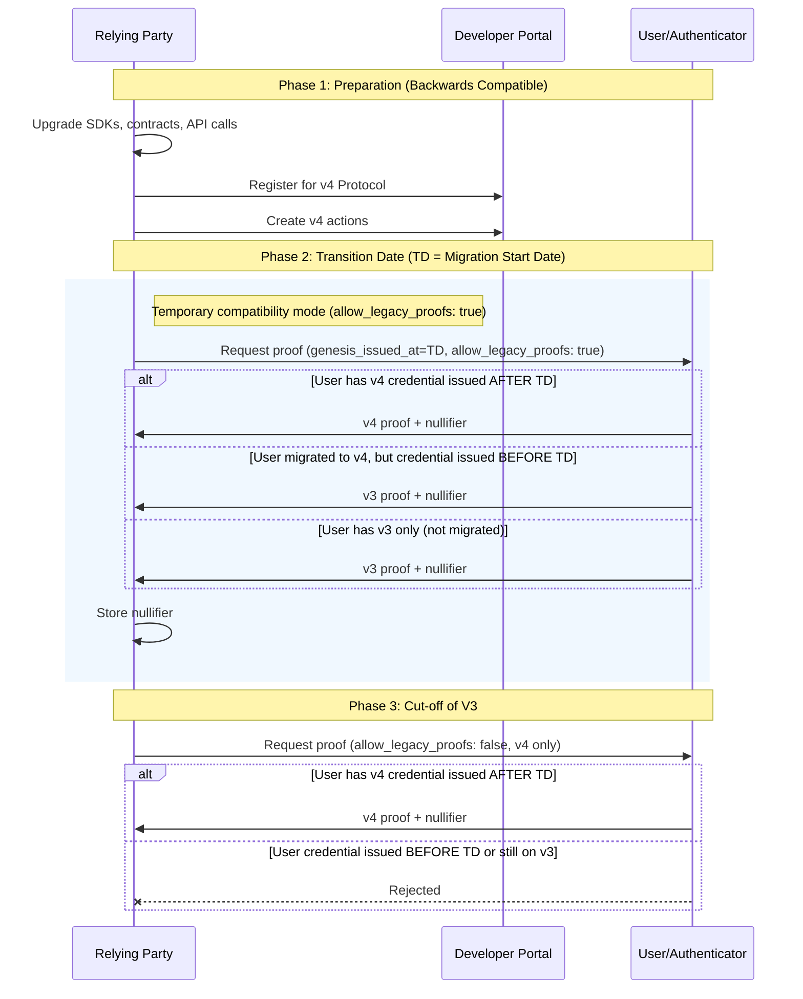
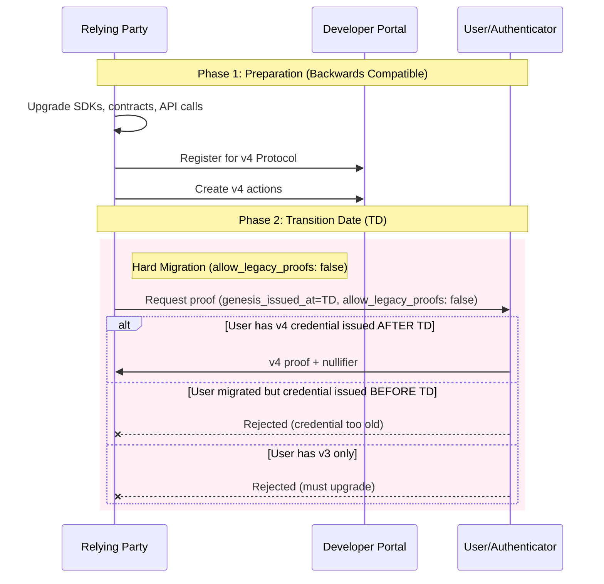
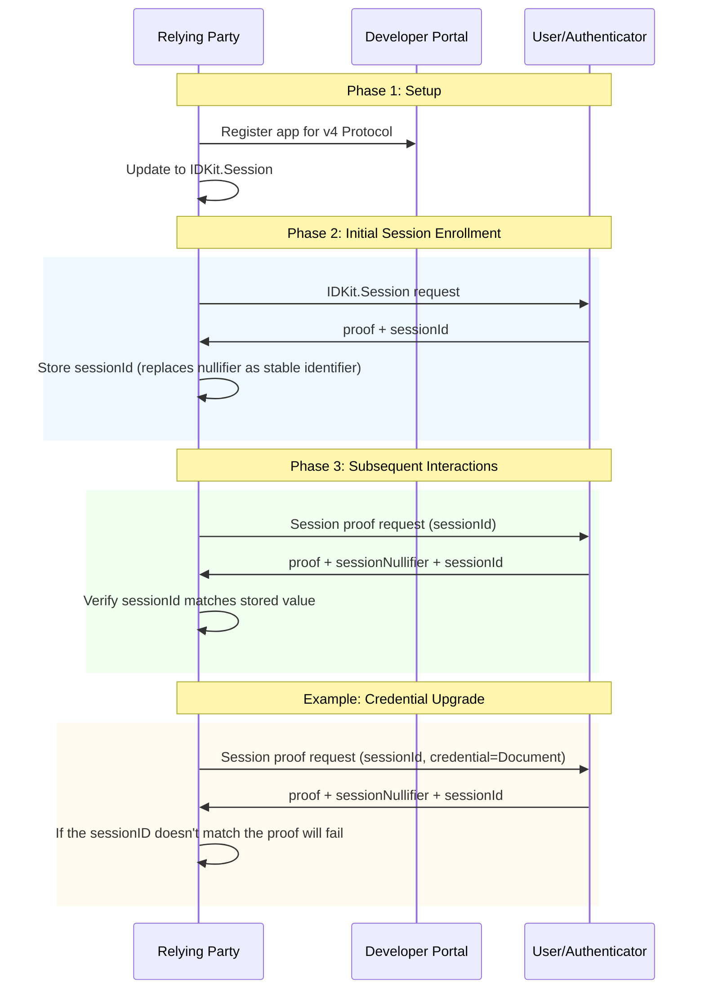

## Start Here

- Register or upgrade your app in the [Developer Portal](https://developer.worldcoin.org).
- Upgrade to IDKit 4.x as we describe below.
- Choose the migration path below based on your app behavior.

### Uniqueness vs Session Proofs (3.0 to 4.0)

World ID 4.0 has two proof types:
- **Uniqueness proofs** for one-time checks.
- **Session proofs** for returning-user continuity (new in 4.0).

In 3.0, many RPs treated nullifiers as persistent user identifiers. In 4.0,
nullifiers are one-time-use, while `session_id` is the stable
link across requests.

| Proof type | World ID 3.0 | World ID 4.0 | What your backend should store |
| --- | --- | --- | --- |
| Uniqueness proof | Nullifier prevented proof reuse. | Nullifier still prevents proof reuse and is one-time-use. | Used nullifiers. |
| Session proof (new in 4.0) | N/A. Nullifier were persistent. | `session_id` links the same user across requests. `session_nullifier` is per-proof replay protection. | `session_id` |

Rule of thumb: use `nullifier` for one-time uniqueness and `session_id` for continuity.

## Upgrading to IDKit 4.x 

A prerequisite to adopting World ID 4.0 is upgrading to IDKit 4.x, which makes major breaking changes to support new protocol. Here's what changed:

1. **RP context is required**: Requests now require `rp_context` (`rp_id`, `nonce`, `created_at`, `expires_at`, `signature`).
2. **IDKit response changed**: You no longer need to reshape the payload or compute `signal_hash` for the verify endpoint. 
3. **[Backend verification endpoint](/api-reference/developer-portal/verify) changed**: Use `POST /api/v4/verify/{rp_id}`.
4. `@worldcoin/idkit-standalone` is discontinued. Use `@worldcoin/idkit-core` for vanilla JS/browser.

For more details and example code, see the [IDKit 4.0 integration guide](/world-id/idkit/integrate).

## Migration Timeline (Phase Dates)

Use these dates as the default migration timeline for planning:

- **Phase 1 (Migration):** through **June 1, 2026**
  - Upgrade SDKs/contracts, register your RP, and create v4 actions.
  - New World App users will have v3 and v4 credentials
- **Phase 2 (Transition):** **June 1, 2026** to **March 31, 2027**
  - New users from this date will only be able to create 4.0 proofs.
  - All users migrated to 4.0
- **Phase 3 (v3 Cut-off):** from **April 1, 2027** onward
  - v3 Proofs will no longer be generated by World App

If your rollout needs more time, extend Phase 2 and move `CD` later.


## Migration Path

Below we outline migration paths based on how you previously used World ID in your application.

### One time actions

These apps have a single long running action.

**Examples:** A stamp for every verified human in the world. A token given to every human in the world once.

<Note>
  **Important:** `genesis_issued_at` is when the user originally got their
  credential (for example, went to an Orb), not when they upgraded their
  authenticator to v4. A user who was Orb-verified in 2023 and upgrades to v4
  in 2025 still has `genesis_issued_at` from 2023.
</Note>

#### Migration Flow Diagram

This diagram shows the three-phase migration process: preparation, gradual transition, and v3 cut-off.



**Summary:** During Phase 2, both v3 and v4 proofs are accepted. Phase 3 enforces v4-only.

<Warning>
  Users who have an old World ID will not be able to claim after Phase 3 as
  their credential will be &lt; TD. Because of this, Phase 2 should be
  sufficiently long, up to one year.
</Warning>

#### Step-by-step Migration Details

1. **Update SDKs and Contracts:** RPs upgrade SDKs, contracts, and API calls to enable baseline support for the upgraded protocol. This is backwards compatible.
2. **Register in Developer Portal:** RPs generate their new RP registration and relevant actions for the v4 protocol in the Developer Portal.
3. **For long-running actions:**
   - RP decides a transition date (`TD`) to start accepting v4 proofs. They specify a minimum `genesis_issued_at = TD` timestamp in the IDKit request with `allow_legacy_proofs: true` as a temporary compatibility mode. This means only users who get their Orb credential (or document credentials) from this point forward can generate v4 proofs. Users who have not upgraded their World App can still issue v3 proofs during this window. RPs should keep track of both nullifiers.
   - At a future cut-off date (`CD > TD`), the RP should switch their IDKit request to `allow_legacy_proofs: false` to stop accepting v3 proofs and only accept v4 proofs.
4. **For limited-time actions** (for example, recurring grant drops): The transition can be made at the action level. Short-running actions have a simpler migration path.

#### Example Code

**Old Contract - Disable minting here:**

```jsx Mint.sol
mapping(uint256 => bool) internal oldNullifierHashes;
mapping(address => bool) public oldHasMinted;

function mint(){
  // Existing logic for checking World ID uniqueness
  if (hasMinted[msg.sender]) revert AlreadyMinted();
  if (nullifierHashes[nullifierHash]) revert DuplicateNullifier(nullifierHash);
}
```

**New Contract - Check both old and new nullifiers:**

```ts Mintv4.sol
mapping(uint256 => bool) internal nullifierHashes;
mapping(address => bool) public hasMinted;

// This function is used to verify a 4.0 proof
function mint({..., nullifier}){
  // Check old contracts and new mapping
  if (OldContract.hasMinted[msg.sender] || hasMinted[msg.sender]) revert AlreadyMinted();
  if (OldContract.oldNullifierHashes[nullifier] || nullifierHashes[nullifier]) revert DuplicateNullifier(nullifier);

  // Verify 4.0 Proof
  Verifier.verify(...)
}

// Needed to support v3 proofs during migration
function mintLegacy({..., nullifierHash}){
  // Check old contracts and new ones
  if (OldContract.hasMinted[msg.sender] || hasMinted[msg.sender]) revert AlreadyMinted();
  if (OldContract.oldNullifierHashes[nullifierHash] || nullifierHashes[nullifierHash]) revert DuplicateNullifier(nullifierHash);

  // Verify Legacy Proof
  WorldIDRouter.verify(...)
}
```

### Short Term Recurring Actions

These apps create multiple one-time actions. These actions are short lived.

**Example:** A daily voting app where each vote requires a fresh proof of unique human.

**Migration approach:** Simply migrate your SDK and Developer Portal account. Pick a new action in the future to start only accepting v4 proofs.
#### Migration Flow Diagram

This diagram shows a simpler two-phase migration with a hard cutover.



**Summary:** During Phase 2, only accept v4 proofs for new actions.

### Recurring Verifications and New Credential Checks

For apps that rely on unlimited verifications of the same action.

**Examples:** Partners that check for users who've added new credentials. Apps that allow users to verify before each claim using the same action (note this is an anti-pattern of World ID).

**Migration approach:** Migrate to using [Session Proofs](https://github.com/worldcoin/world-id-protocol/blob/main/docs/world-id-4-specs/README.md#session-proofs), which allow developers to verify credentials over a period of time while ensuring it's the same user. The session ID returned in the proof will be the long-lived stable identifier instead.

#### Migration Flow Diagram

This diagram shows how Session Proofs provide a stable identifier across multiple verifications.



**Summary:** Session IDs provide continuity across verifications, replacing nullifiers as the stable identifier.

```jsx Creating a session
export async function createSession() {
  const rpContext = await fetch("/api/worldid/rp-context").then((r) => r.json());

  const request = await IDKit.createSession({
    app_id: APP_ID,
    rp_context: rpContext,
  }).constraints(any(CredentialRequest("orb")));

  // Web only: render this QR URL
  const qrUrl = request.connectorURI;

  const completion = await request.pollUntilCompletion({ timeout: 120000 });
  if (!completion.success) throw new Error(completion.error);

  const verify = await fetch("/api/worldid/verify", {
    method: "POST",
    headers: { "Content-Type": "application/json" },
    body: JSON.stringify(completion.result),
  }).then((r) => r.json());

  if (!verify.success) throw new Error("Verification failed");

  // IMPORTANT: Save this in order to prove future sessions for the same user
  return completion.result.session_id;
}
```

```tsx Proving a session
// sessionId should have been saved when you created the session
export async function proveSession(sessionId) {
  const rpContext = await fetch("/api/worldid/rp-context").then((r) => r.json());

  const request = await IDKit.proveSession(sessionId, {
    app_id: APP_ID,
    rp_context: rpContext,
  }).constraints(any(CredentialRequest("orb")));

  const completion = await request.pollUntilCompletion({ timeout: 120000 });
  if (!completion.success) throw new Error(completion.error);

  const verify = await fetch("/api/worldid/verify", {
    method: "POST",
    headers: { "Content-Type": "application/json" },
    body: JSON.stringify(completion.result),
  }).then((r) => r.json());

  if (!verify.success) throw new Error("Verification failed");

  return verify;
}
```

### New Apps

Apps launched after v4 is fully released will not need to migrate.

## Further Migration Details

- Recovery applies to users in the v4 protocol. Users with pre-v4 credentials
  may receive a new credential based on issuer policy, while `genesis_issued_at`
  still reflects original issuance date.
