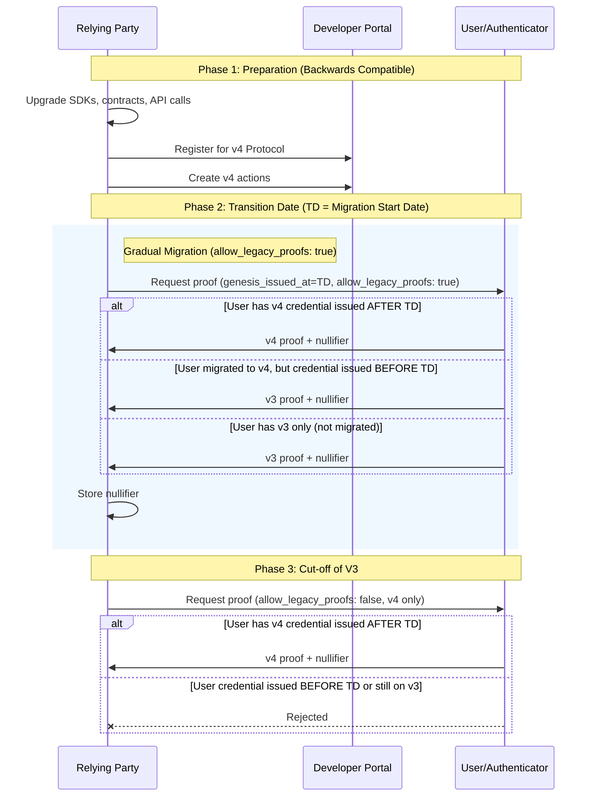
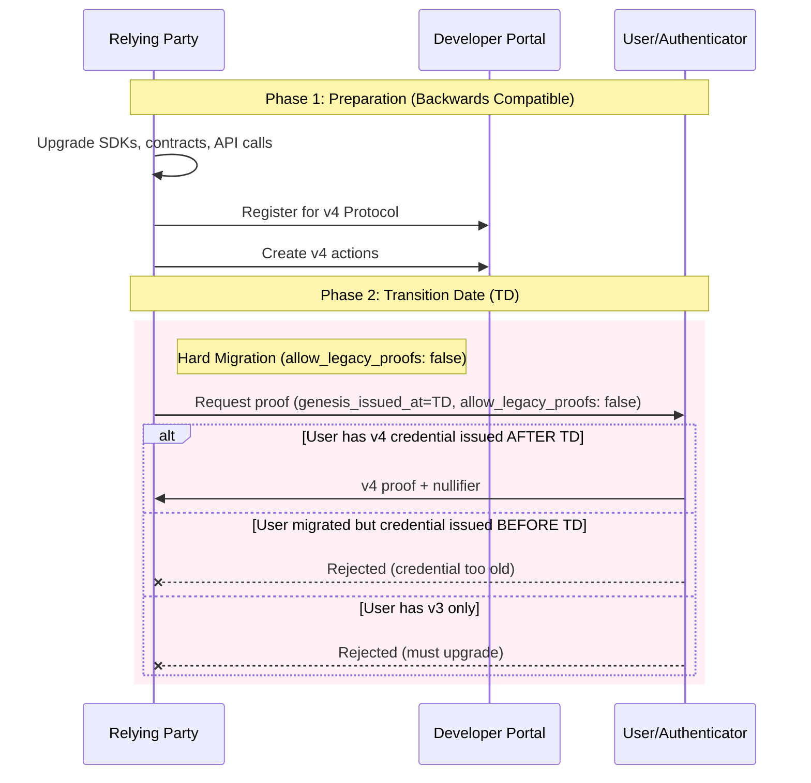
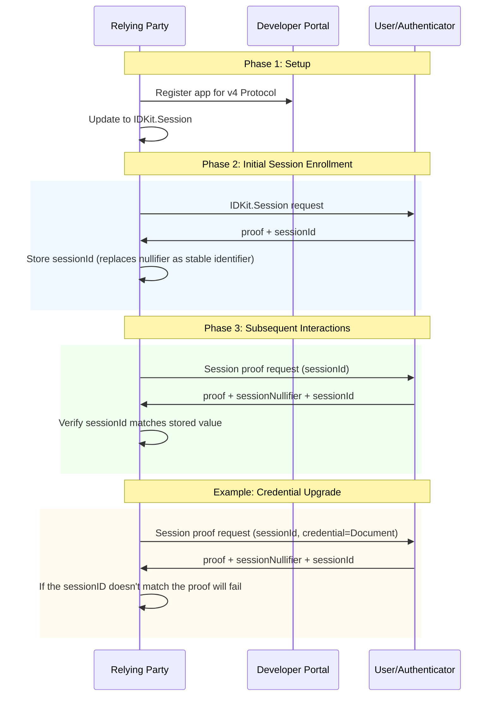

### Overview

*World ID 4.0 unlocks powerful new capabilities for your app:*

- **New credential types**: More flexibility in requesting proofs with new credential options and third party issuance
- **World ID proofs without World App**: You can generate World ID proofs directly in your own native app without needing the World App.
- **Account Recovery**: Recovery flows and other improvements to prevent users from losing their World IDs.

### To migrate:

- Register in the [Developer Portal](https://developer.worldcoin.org) and generate new keys
- Upgrade IDKit/MiniKit to 4.0. This is non breaking and supports v3 and v4 proofs.
- Follow the respective migration plan below
- On chain applications will require new World ID 4.0 contract addresses to verify proofs

<Note>
  Migrating your app in the Developer Portal is not a breaking change. You can
  do this before migrating your app logic to World ID 4.0. Authenticators will
  support 3.0 proofs at least until the end of the year for existing users. New
  users will stop being registered with legacy 3.0 from **May 1, 2026**.
</Note>

### Definitions:
- Relying Party (RP): An application that uses World ID to verify users.
- Session Proofs: A new proof type in World ID 4.0 that lets an RP verify a returning user is the same World ID holder they interacted with previously. Session Proofs last the lifetime of a user's World ID

## Migration Timeline (Phase Dates)

Use these dates as the default migration timeline referenced throughout this guide, some dates may shift later: 

- **Phase 1 (Migration):** through **May 1, 2026**
  - Upgrade SDKs/contracts, register your RP, and create v4 actions.
  - New World App users will have v3 and v4 credentials
- **Phase 2 (Transition):** **May 1, 2026** to **March 31, 2027**
  - New users from this date will only be able to create 4.0 proofs.
  - All users migrated to 4.0
- **Phase 3 (v3 Cut-off):** from **April 1, 2027** onward
  - v3 Proofs will no longer be generated by World App

<Note>
  If your rollout needs more time, extend Phase 2 and move `CD` later. Keep
  Phase 2 long enough to avoid excluding users with older credentials.
</Note>

## New API Design

### Backend Setup (Node.js)

```tsx Backend Signing
import { signRequest } from '@worldcoin/idkit-core'

const rpSignature = signRequest(
  'verify-human',             // action
  process.env.RP_SIGNING_KEY, // your private key
  // ttlSeconds optional, defaults to 300
)

// Send to frontend
return {
  rp_id: 'rp_123456789abcdef0',       // your registered RP ID
  nonce: rpSignature.nonce,           // auto-generated
  created_at: rpSignature.createdAt,  // auto-generated by SDK
  expires_at: rpSignature.expiresAt,  // auto-generated by SDK
  signature: rpSignature.sig,         // auto-generated
}
```

### Frontend Implementation

```tsx Compatibility flow for 3.0
import { orbLegacy } from '@worldcoin/idkit-core'

// 1. Create verification request (builder pattern)
const request = await IDKit.request({
  app_id: 'app_staging_xxxxx',
  action: 'verify-human',
  allow_legacy_proofs: true,         // true: accept v3 + v4 | false: v4 only
  rp_context: rpContextFromBackend,  // object returned from backend
}).preset(orbLegacy({ signal: 'user-123' }))

// 3. Display QR code
console.log('Scan with World App:', request.connectorURI)
// Or render as QR: <QRCode value={request.connectorURI} />

// 4. Wait for proof
const completion = await request.pollUntilCompletion({
  pollInterval: 1000,                    // ms between polls (default: 1000)
  timeout: 300000,                       // max wait time in ms (default: 300000 = 5 min)
  signal: abortController.signal,        // optional AbortSignal for cancellation
})

if (!completion.success) {
  console.error('Verification failed:', completion.error)
  return
}

// 5. Send proof to your backend for verification
console.log(completion.result)
```

## Migration Path

Below we outline migration paths based on how you previously used World ID in your application.

### One time actions

These apps have a single long running action.

**Examples:** A stamp for every verified human in the world. A token given to every human in the world once.

<Note>
  **Important:** `genesis_issued_at` is when the user originally got their
  credential (for example, went to an Orb), not when they upgraded their
  authenticator to v4. A user who was Orb-verified in 2023 and upgrades to v4
  in 2025 still has `genesis_issued_at` from 2023.
</Note>

#### Migration Flow Diagram

This diagram shows the three-phase migration process: preparation, gradual transition, and v3 cut-off.



**Summary:** During Phase 2, both v3 and v4 proofs are accepted. Phase 3 enforces v4-only.

<Warning>
  Users who have an old World ID will not be able to claim after Phase 3 as
  their credential will be &lt; TD. Because of this, Phase 2 should be
  sufficiently long, up to one year.
</Warning>

#### Step-by-step Migration Details

1. **Update SDKs and Contracts:** RPs upgrade SDKs, contracts, and API calls to enable baseline support for the upgraded protocol. This is backwards compatible.
2. **Register in Developer Portal:** RPs generate their new RP registration and relevant actions for the v4 protocol in the Developer Portal.
3. **For long-running actions:**
   - RP decides a transition date (`TD`) to start accepting v4 proofs. They specify a minimum `genesis_issued_at = TD` timestamp in the IDKit request with `allow_legacy_proofs: true`. This means only users who get their Orb credential (or document credentials) from this point forward can generate v4 proofs. Users who have not upgraded their World App can still issue v3 proofs. RPs should keep track of both nullifiers. The nullifiers can be kept together as collision risk is very low.
   - At a future cut-off date (`CD > TD`), the RP should switch their IDKit request to `allow_legacy_proofs: false` to stop accepting v3 proofs and only accept v4 proofs.
4. **For limited-time actions** (for example, recurring grant drops): The transition can be made at the action level. Short-running actions have a simpler migration path.

#### Example Code

**Old Contract - Disable minting here:**

```jsx Mint.sol
mapping(uint256 => bool) internal oldNullifierHashes;
mapping(address => bool) public oldHasMinted;

function mint(){
  // Existing logic for checking World ID uniqueness
  if (hasMinted[msg.sender]) revert AlreadyMinted();
  if (nullifierHashes[nullifierHash]) revert DuplicateNullifier(nullifierHash);
}
```

**New Contract - Check both old and new nullifiers:**

```ts Mintv4.sol
mapping(uint256 => bool) internal nullifierHashes;
mapping(address => bool) public hasMinted;

// This function is used to verify a 4.0 proof
function mint({..., nullifier}){
  // Check old contracts and new mapping
  if (OldContract.hasMinted[msg.sender] || hasMinted[msg.sender]) revert AlreadyMinted();
  if (OldContract.oldNullifierHashes[nullifier] || nullifierHashes[nullifier]) revert DuplicateNullifier(nullifier);

  // Verify 4.0 Proof
  Verifier.verify(...)
}

// Needed to support v3 proofs during migration
function mintLegacy({..., nullifierHash}){
  // Check old contracts and new ones
  if (OldContract.hasMinted[msg.sender] || hasMinted[msg.sender]) revert AlreadyMinted();
  if (OldContract.oldNullifierHashes[nullifierHash] || nullifierHashes[nullifierHash]) revert DuplicateNullifier(nullifierHash);

  // Verify Legacy Proof
  WorldIDRouter.verify(...)
}
```

### Short Term Recurring Actions

These apps create multiple one-time actions. These actions are short lived.

**Example:** A daily voting app where each vote requires a fresh proof of human.

**Migration approach:** Simply migrate your SDK and Developer Portal account. Pick a new action in the future to start only accepting v4 proofs.
#### Migration Flow Diagram

This diagram shows a simpler two-phase migration with a hard cutover.



**Summary:** During Phase 2, only accept v4 proofs for new actions.

### Recurring Verifications and New Credential Checks

For apps that rely on unlimited verifications of the same action.

**Examples:** Partners that check for users who've added new credentials. Apps that allow users to verify before each claim using the same action (note this is an anti-pattern of World ID).

**Migration approach:** Migrate to using [Session Proofs](https://github.com/worldcoin/world-id-protocol/blob/main/docs/world-id-4-specs/README.md#session-proofs), which allow developers to verify credentials over a period of time while ensuring it's the same user. The session ID returned in the proof will be the long-lived stable identifier instead.

#### Migration Flow Diagram

This diagram shows how Session Proofs provide a stable identifier across multiple verifications.



**Summary:** Session IDs provide continuity across verifications, replacing nullifiers as the stable identifier.

```jsx Creating a session
export async function createSession() {
  const rpContext = await fetch("/api/worldid/rp-context").then((r) => r.json());

  const request = await IDKit.createSession({
    app_id: APP_ID,
    rp_context: rpContext,
  }).constraints(any(CredentialRequest("orb")));

  // Web only: render this QR URL
  const qrUrl = request.connectorURI;

  const completion = await request.pollUntilCompletion({ timeout: 120000 });
  if (!completion.success) throw new Error(completion.error);

  const verify = await fetch("/api/worldid/verify", {
    method: "POST",
    headers: { "Content-Type": "application/json" },
    body: JSON.stringify(completion.result),
  }).then((r) => r.json());

  if (!verify.success) throw new Error("Verification failed");

  // IMPORTANT: Save this in order to prove future sessions for the same user
  return completion.result.session_id;
}
```

```tsx Proving a session
// sessionId should have been saved when you created the session
export async function proveSession(sessionId) {
  const rpContext = await fetch("/api/worldid/rp-context").then((r) => r.json());

  const request = await IDKit.proveSession(sessionId, {
    app_id: APP_ID,
    rp_context: rpContext,
  }).constraints(any(CredentialRequest("orb")));

  const completion = await request.pollUntilCompletion({ timeout: 120000 });
  if (!completion.success) throw new Error(completion.error);

  const verify = await fetch("/api/worldid/verify", {
    method: "POST",
    headers: { "Content-Type": "application/json" },
    body: JSON.stringify(completion.result),
  }).then((r) => r.json());

  if (!verify.success) throw new Error("Verification failed");

  return verify;
}
```

### New Apps

Apps launched after v4 is fully released will not need to migrate.

## Deprecating Verification Level

With the introduction of credentials, a minimum verification level no longer makes sense. Credentials can now be requested arbitrarily via `all`, `any`, and `enumerate`.

For convenience, we have introduced legacy presets that mirror the respective verification levels from the 3.0 protocol:

- `OrbLegacyPreset`
- `SecureDocumentLegacyPreset`
- `DocumentLegacyPreset`

### Example: Using Legacy Presets

```jsx
import { orbLegacy } from '@worldcoin/idkit-core'

// Fetch RP signature from your backend
const rpSig = await fetch('/api/rp-signature').then(r => r.json())

const request = await IDKit.request({
  app_id: 'app_xxxxx',
  action: 'verify-human',
  allow_legacy_proofs: true,  // true: accept v3 + v4 | false: v4 only
  rp_context: {
    rp_id: 'rp_123456789abcdef0',
    nonce: rpSig.nonce,
    created_at: rpSig.created_at,
    expires_at: rpSig.expires_at,
    signature: rpSig.sig,
  },
}).preset(orbLegacy({ signal: 'user-123' }))

console.log('Scan:', request.connectorURI)

const completion = await request.pollUntilCompletion()
if (completion.success) {
  console.log('Proof:', completion.result)
} else {
  console.error('Failed:', completion.error)
}
```

## Recovery

<Note>
  **Context:** The Recovery feature will optionally let users who lose access
  to all authenticators recover their existing World ID account. This only
  works for users in the new v4 protocol - users in the legacy v3 protocol will
  not be able to directly recover their existing World ID.
</Note>

- Users who verified (obtained their Orb credential) prior to the introduction of World ID 4.0 will be able to get a new credential in a new World ID in the new protocol once, essentially looking new. This is an issuer decision, and it has been called Reset in the past.
  - Importantly, `genesis_issued_at` still defers to the original credential issuance date, allowing you to prevent double claims.

## Disclosures

- Nullifiers are now one-time use. Applications that need a stable identifier across verifications should use session proofs. After creation, sessions require an RP to pass the same session ID in future session verifications.
- New users after the migration to 4.0 will not have a legacy (3.0) World ID.
  - Estimate: May 1, 2026
