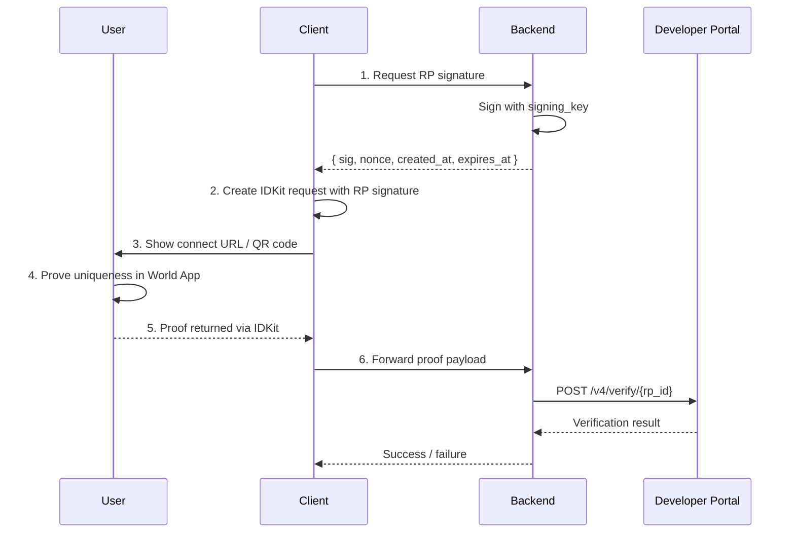

IDKit is our solution for integrating World ID. You can use the React SDK for a pre-built widget or the JS and mobile SDKs for a custom integration.

To familiarize yourself with the core concepts of World ID, check out this [page](/world-id/concepts).
<Note>
  Ensure you are using IDKit v4.0.0 or later.
</Note>

# Step 1: Install IDKit

<CodeGroup title="Install">
```bash title="JavaScript"
npm i @worldcoin/idkit-core
```

```bash title="React"
npm i @worldcoin/idkit
```

```swift title="Swift (SPM)"
.package(url: "https://github.com/worldcoin/idkit-swift.git", from: "<version>")
```

```kotlin title="Kotlin (Gradle)"
dependencies {
    implementation("com.worldcoin:idkit:<version>")
}
```
</CodeGroup>

# Step 2: Create an app in the Developer Portal

Create your app in the [Developer Portal](https://developer.world.org). Keep these values:
  - `app_id`
  - `rp_id`
  - `signing_key` - this should be stored as a secret.

# Step 3: Generate an RP signature in your backend
Signatures verify that proof requests genuinely come from your app, preventing attackers from performing impersonation attacks.
```typescript title="app/api/rp-signature/route.ts"
import { NextResponse } from "next/server";
import { signRequest } from "@worldcoin/idkit/signing";

export async function POST(request: Request): Promise<Response> {
  const { action } = await request.json();
  const signingKey = process.env.RP_SIGNING_KEY!;

  const { sig, nonce, createdAt, expiresAt } = signRequest(action, signingKey);

  return NextResponse.json({
    sig,
    nonce,
    created_at: createdAt,
    expires_at: expiresAt,
  });
}
```
<Warning>
  Never generate RP signatures on the client and never expose your RP signing
  key. If the key leaks, attackers can forge requests from your app.
</Warning>


# Step 4: Generate the connect URL and collect proof

<CodeGroup title="Create request and collect proof">
```typescript title="JavaScript"
import { IDKit, orbLegacy } from "@worldcoin/idkit-core";

const rpSig = await fetch("/api/rp-signature", {
  method: "POST",
  headers: { "content-type": "application/json" },
  body: JSON.stringify({ action: "my-action" }),
}).then((r) => r.json());

const request = await IDKit.request({
  // App ID: `app_id` from the Developer Portal
  app_id: "app_xxxxx",
  // Action: Context that scopes what the user is proving uniqueness for
  // e.g., "verify-account-2026" or "claim-airdrop-2026".
  action: "my-action", 
  rp_context: {
    rp_id: "rp_xxxxx", // Your app's `rp_id` from the Developer Portal
    nonce: rpSig.nonce,
    created_at: rpSig.created_at,
    expires_at: rpSig.expires_at,
    signature: rpSig.sig,
  },
  allow_legacy_proofs: true,
  environment: "production",
  // Signal (optional): Bind specific context into the requested proof. 
  // Examples: user ID, wallet address. Your backend should enforce the same value.
}).preset(orbLegacy({ signal: "local-election-1" }));

const connectUrl = request.connectorURI;
const response = await request.pollUntilCompletion();
```

```tsx title="React"
import {
  IDKitRequestWidget,
  orbLegacy,
  type RpContext,
} from "@worldcoin/idkit";

const rpSig = await fetch("/api/rp-signature", {
  method: "POST",
  headers: { "content-type": "application/json" },
  body: JSON.stringify({ action: "my-action" }),
}).then((r) => r.json());

const rp_context: RpContext = {
  rp_id: "rp_xxxxx", // Your app's `rp_id` from the Developer Portal
  nonce: rpSig.nonce,
  created_at: rpSig.created_at,
  expires_at: rpSig.expires_at,
  signature: rpSig.sig,
};

// ...
 
<IDKitRequestWidget
  open={open}
  onOpenChange={setOpen}
  app_id="app_xxxxx" // Your app's `app_id` from the Developer Portal
  // Action: Context that scopes what the user is proving uniqueness for
  // e.g., "verify-account-2026" or "claim-airdrop-2026".
  action="my-action"
  rp_context={rp_context}
  allow_legacy_proofs={true}
  // Signal (optional): Bind specific context into the requested proof.
  // Examples: user ID, wallet address. Your backend should enforce the same value.
  preset={orbLegacy({ signal: "local-election-1" })}
  onSuccess={async (result) => {
    const verification = await fetch("/api/verify-proof", {
      method: "POST",
      headers: { "content-type": "application/json" },
      body: JSON.stringify(result),
    }).then((r) => r.json());
    // Verified! Mark the user as verified in your app and show a success message.
  }}
/>;
```

```swift title="Swift"
import IDKit

// Fetch the RP signature from your backend
let rpSig = try await yourBackend.fetchRpSignature(action: "my-action")

let rpContext = try RpContext(
  rpId: "rp_xxxxx", // Your app's `rp_id` from the Developer Portal
  nonce: rpSig.nonce,
  createdAt: rpSig.createdAt,
  expiresAt: rpSig.expiresAt,
  signature: rpSig.sig
)

let config = IDKitRequestConfig(
  // App ID: `app_id` from the Developer Portal
  appId: "app_xxxxx", 
  // Action: Context that scopes what the user is proving uniqueness for
  // e.g., "verify-account-2026" or "claim-airdrop-2026".
  action: "my-action",
  rpContext: rpContext,
  actionDescription: "Verify user",
  bridgeUrl: nil,
  allowLegacyProofs: true,
  overrideConnectBaseUrl: nil,
  environment: .production
)

// Signal (optional): Bind specific context into the requested proof.
// Examples: user ID, wallet address. Your backend should enforce the same value.
let request = try IDKit.request(config: config).preset(orbLegacy(signal: "local-election-1"))
let connectUrl = request.connectorURL
let completion = await request.pollUntilCompletion()
```

```kotlin title="Kotlin"
import com.worldcoin.idkit.IDKit
import com.worldcoin.idkit.IDKitRequestConfig
import com.worldcoin.idkit.RpContext
import com.worldcoin.idkit.Environment
import com.worldcoin.idkit.orbLegacy

// Fetch the RP signature from your backend (see Step 2)
val rpSig = yourBackend.fetchRpSignature(action = "my-action")

val rpContext = RpContext(
  rpId = "rp_xxxxx", // Your app's `rp_id` from the Developer Portal
  nonce = rpSig.nonce,
  createdAt = rpSig.createdAt.toULong(),
  expiresAt = rpSig.expiresAt.toULong(),
  signature = rpSig.sig,
)

val config = IDKitRequestConfig(
  // App ID: `app_id` from the Developer Portal
  appId = "app_xxxxx", 
  // Action: Context that scopes what the user is proving uniqueness for
  // e.g., "verify-account-2026" or "claim-airdrop-2026".
  action = "my-action",
  rpContext = rpContext,
  allowLegacyProofs = true,
)

// Signal (optional): Bind specific context into the requested proof.
// Examples: user ID, wallet address. Your backend should enforce the same value.
val request = IDKit.request(config).preset(orbLegacy(signal = "local-election-1"))
val connectorURI = request.connectorURI
val completion = request.pollUntilCompletion()
```
</CodeGroup>

# Step 5: Verify the proof in your backend

After successful completion, send the returned payload to your backend and
forward it directly to: `POST https://developer.world.org/api/v4/verify/{rp_id}`

<Note>
  Forward the IDKit result payload as-is. No field remapping is required.
</Note>

```typescript title="app/api/verify-proof/route.ts"
import { NextResponse } from "next/server";
import type { IDKitResult } from "@worldcoin/idkit";

export async function POST(request: Request): Promise<Response> {
  const { rp_id, devPortalPayload } = (await request.json()) as {
    rp_id: string;
    devPortalPayload: IDKitResult;
  };

  const response = await fetch(
    `https://developer.world.org/api/v4/verify/${rp_id}`,
    {
      method: "POST",
      headers: { "content-type": "application/json" },
      body: JSON.stringify(devPortalPayload),
    },
  );

  const payload = await response.json();
  return NextResponse.json(payload, { status: response.status });
}
```


## Architecture overview



## Next pages

- [POST /v4/verify reference](/api-reference/developer-portal/verify)
